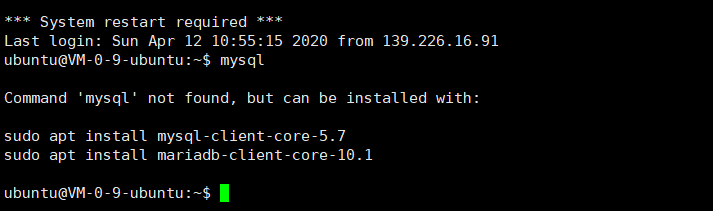
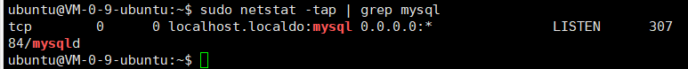
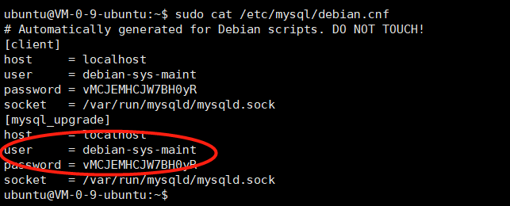
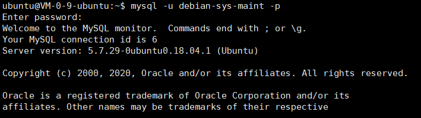
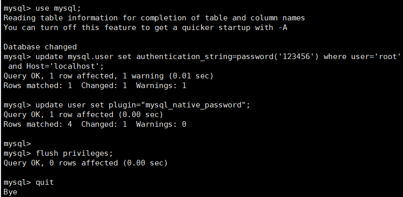

# 简介
这里介绍一下在远程服务器安装MySQL数据库，并通过远程SSH连接的操作步骤。本文采用的远程云服务器为阿里云，操作系统Ubuntu 18.04.1 LTS。
# 在服务器中安装mysql
首先，在XShell软件下输入主机号、用户名和密码，登陆进入阿里云。




依次输入以下三条命令：
1. sudo apt-get install mysql-server
2. sudo apt install mysql-client
3. sudo apt install libmysqlclient-dev

输入如下命令进行检验是否安装mysql成功，下图为安装成功显示结果。

sudo netstat -tap | grep mysql



由于mysql版本更新，在安装过程中不再提示输入初始密码，因此需要手动设置用户名和密码（这里以用户名root和密码123456为例）

输入 ```sudo cat /etc/mysql/debian.cnf```，下图中画圈的部分就是安装mysql后的初始用户名和密码



根据上述用户名和密码，可以登录进入mysql，如下图所示：



上述初始用户名和密码比较复杂，不利于下次登录，这里我们将用户名改为root，密码改为123456。

依次执行下列语句：
```
use mysql;
update mysql.user set authentication_string=password('123456') where user='root' and Host ='localhost';
update user set plugin="mysql_native_password"; 
flush privileges;
quit;
```


重新启动mysql并按照新的用户名和密码启动


如图所示，用户名和密码修改完成，并登陆成功。

# 利用SSH实现数据库的远程连接

1. 进入MySQL：mysql-uroot-p你的密码
2. 在mysql环境下执行授权命令（授权给远程任何电脑登录数据库）：
GRANT ALL PRIVILEGES ON *.* TO 'root'@'%' IDENTIFIED BY '你的密码' WITH GRANT OPTION;
3. 刷新配置信息
flush privileges;    
4. 退出mysql服务:输入exit命令退出mysql服务
5. 执行如下命令重启mysql：sudo service mysql restart

连接过程中若出现如下问题：搭建完MySQL，用远程连接工具（Navicat）连接时报错：2013-Lost connection to MySQL server at 'waiting for intial communication packet',system error:0

1. 找到mysql安装配置文件：my.cnf；路径因环境而异。如果你的是Liunx的环境，可以去目录：/etc/my.cnf中查找
2. 编辑文件：my.cnf（vim /etc/mysql/my.cnf），找到【mysqld】模块（没有就自行添加）在其下增加一行：skip-name-resolve
3. 保存退出，并重启mysql服务：service mysql restart 即可，再重新连接看看！
